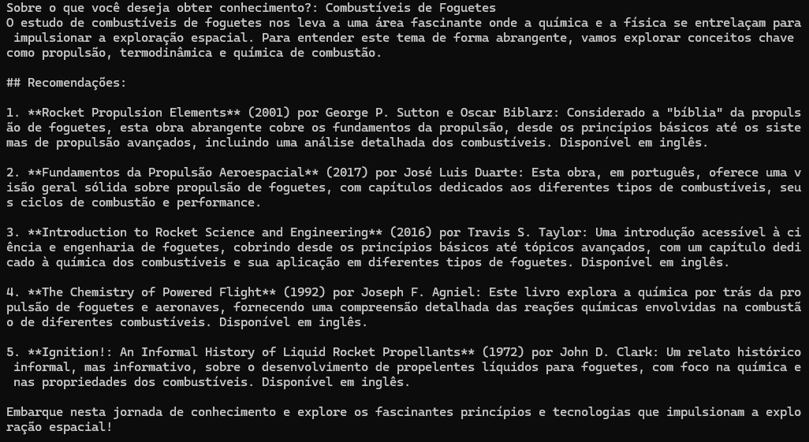

# Mimisbrunnr

*"I strove to find future and knowledge  
When I drank from wisdom's spring  
One eye I gave to Mimir the guardian"*

\- Odin, song by Rebellion




"Mimisbrunnr é um sistema de recomendação de livros curados, inspirado no mito do Poço da Sabedoria de Mimir da mitologia nórdica. Nossa missão é elevar o conhecimento humano, promovendo uma mentalidade crítica, racional e científica. Diga sobre o que você deseja obter conhecimento e receberá recomendações focadas nos tópicos fundamentais para que você possa obter um entendimento de qualidade."


## Configuração
Utilize um console ou PowerShell para executar os comandos.

### 1.1 - Criar Ambiente Virtual (opcional)
Para Windows
```
python -m venv myenv
```

Para Linux/Mac
```
python3 -m venv myenv
```

### 1.2 - Ativar o Ambiente Virtual (opcional)
Para Windows
```
.\myenv\Scripts\Activate
```

Para Linux/Mac
```
source myenv/bin/activate
```

### 2 - Instalar pacotes

```
pip install -r requirements.txt
```

### 3 - Executar script

```
python mimisbrunnr.py
```


## Desenvolvimento
### Mimisbrunnr v1

- :white_check_mark: **Construção** do Planejamento de Projeto e uma lista de tarefas a serem concluídas
    - Extenso refill :coffee: e uma longa playlist :notes:...
- :white_check_mark: **Planejamento e Construção** do MVP, um script que recebe um tema de forma simples e executa um prompt para obter recomendações de livros e publicações
- :white_check_mark: **Teste** extensivo do script, para reduzir as chances de ele retornar resultados não interessantes
- :white_check_mark: **Evolução** do MVP para obter recomendações de outras fontes como documentários, artigos e vídeos, além de fazê-lo de forma mais estruturada
- :white_check_mark: **Evolução** do MVP para descartar resultados não significativos, buscar fontes mais curadas e ajuste ético e filosófico

### Mimisbrunnr v2

- :coffee: **Planejamento e Construção** de uma estrutura Web em Django com uma página simples para fazer a pesquisa
- **Evolução** da estrutura Web pensando em reusabilidade e UI (o pouco que sei), utilizando bibliotecas frontend
- **Refinamento** da apresentação, aplicando uma interface amigável

### Mimisbrunnr v3

Even flow, thoughts arrive like butterflies...