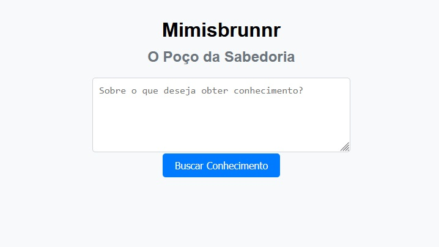

# Mimisbrunnr

*"I strove to find future and knowledge  
When I drank from wisdom's spring  
One eye I gave to Mimir the guardian"*

\- Odin, song by Rebellion


"Mimisbrunnr é um sistema de recomendação web de livros curados, inspirado no mito do Poço da Sabedoria de Mimir da mitologia nórdica. Nossa missão é elevar o conhecimento humano, promovendo uma mentalidade crítica, racional e científica. Diga sobre o que você deseja obter conhecimento e receberá recomendações focadas nos tópicos fundamentais para que você possa obter um entendimento de qualidade."


## Configuração
Esse guia assume que você está familiarizado com o uso de algum console e que fez o clone do projeto em seu computador. Uma vez feito isso, navegue para a pasta do projeto e execute os comandos abaixo.

### 1 - Adicione uma chave de API do Google AI
Para que sistema funcione corretamente, é necessário uma chave de API do Google AI que pode ser obtida em https://aistudio.google.com/app/apikey. Uma vez obtida a chave, crie um arquivo chamado 'config.ini' na pasta raiz do projeto e adicione o seguinte conteúdo nele

```
[config]
GOOGLE_AI_API_KEY = sua-api-key

```

### 2.1 - Criar Ambiente Virtual (opcional)
Para Windows
```
python -m venv myenv
```

Para Linux/Mac
```
python3 -m venv myenv
```

### 2.2 - Ativar o Ambiente Virtual (opcional)
Para Windows
```
.\myenv\Scripts\Activate
```

Para Linux/Mac
```
source myenv/bin/activate
```

### 3 - Instalar pacotes

```
pip install -r requirements.txt
```

### 4 - Executar Servidor Local Django
Navegue até a pasta 'mimir' e execute o comando:

```
python manage.py runserver
```

Uma mensagem semelhante a seguir deve ser mostrada no console. É o indicativo que o servidor web está funcionando corretamente.

```py
May 11, 2024 - 00:00:14
Django version 5.0.6, using settings 'mimir.settings'
Starting development server at http://127.0.0.1:8000/
Quit the server with CTRL-BREAK.
```

### 5 - Acesse o Sistema
O sistema pode ser acessado via qualquer navegador web através do endereço
http://localhost:8000 

## Utilização


O sistema apresenta um campo de texto e um botão de busca. Digite o tema ou conceito que você deseja entender e obter recomendações de leitura e clique no botão. Devido a integração com um LLM, a busca pode demorar alguns segundos. O resultado será mostrado logo abaixo.


É possível fazer imediatamente uma nova Busca, porém se o resultado atual for importante certifique-se de copiar o texto e guardá-lo pois o sistema não o guarda de nenhuma forma.


## Desenvolvimento
### Mimisbrunnr v1

- :white_check_mark: **Construção** do Planejamento de Projeto e uma lista de tarefas a serem concluídas
    - Extenso refill :coffee: e uma longa playlist :notes:...
- :white_check_mark: **Planejamento e Construção** do MVP, um script que recebe um tema de forma simples e executa um prompt para obter recomendações de livros e publicações
- :white_check_mark: **Teste** extensivo do script, para reduzir as chances de ele retornar resultados não interessantes
- :white_check_mark: **Evolução** do MVP para obter recomendações de outras fontes como documentários, artigos e vídeos, além de fazê-lo de forma mais estruturada
- :white_check_mark: **Evolução** do MVP para descartar resultados não significativos, buscar fontes mais curadas e ajuste ético e filosófico

### Mimisbrunnr v2

- :white_check_mark: **Planejamento e Construção** de uma estrutura Web em Django com uma página simples para fazer a pesquisa
- :coffee: **Evolução** da estrutura Web pensando em reusabilidade e UI, utilizando bibliotecas frontend como Bootstrap
- **Refinamento** da apresentação, aplicando uma interface amigável, imagens, etc

### Mimisbrunnr v3

Even flow, thoughts arrive like butterflies...